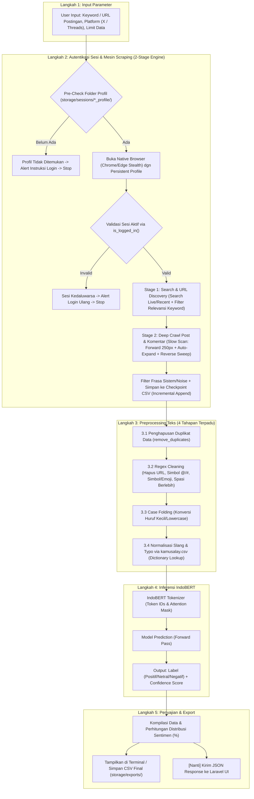

# 🏛️ Arsitektur & Spesifikasi Sistem Backend (AI & Data Pipeline)
> **Proyek**: Sistem Analisis Sentimen Opini Publik (X & Threads) menggunakan Fine-Tuned IndoBERT  
> **Arsitektur**: Modular Service-Oriented (CLI Terminal Ready & FastAPI Microservice Ready)  
> **Status**: Dokumen Spesifikasi Struktur & Alur Sistem

---

## 📁 1. Struktur Folder & Berkas Lengkap

```text
backend/
│
├── configs/                                # Konfigurasi Terpusat Sistem
│   ├── __init__.py
│   ├── config.py                           # Parameter global, path direktori, hyperparameter inference
│   └── .env.example                        # Template environment variable
│
├── storage/                                # Penyimpanan Runtime & File Pendukung
│   ├── dictionaries/                       # Kamus data pendukung
│   │   └── kamusalay.csv                   # Kamus normalisasi kata tidak baku (slang)
│   ├── sessions/                           # Penyimpanan direktori persistent profile browser
│   │   ├── threads_profile/                # User Data Directory sesi Threads / Instagram
│   │   └── x_profile/                      # User Data Directory sesi X (Twitter)
│   └── exports/                            # Hasil output data (CSV/Excel/JSON) & file Checkpoint
│
├── saved_models/                           # Model IndoBERT Hasil Fine-Tuning (Dari Colab)
│   └── indobert_sentiment/                 # Folder checkpoint model yang sudah jadi
│       ├── config.json                     # Konfigurasi arsitektur model IndoBERT
│       ├── pytorch_model.bin (atau .pt)    # Bobot (weights) model hasil fine-tuning
│       ├── tokenizer_config.json           # Konfigurasi tokenizer
│       └── vocab.txt                       # Kosakata tokenizer IndoBERT
│
├── src/                                    # Source Code Inti Logika Bisnis (Core Logic)
│   ├── __init__.py
│   │
│   ├── auth/                               # [MODUL 1] Manajemen Autentikasi & Persistent Profile
│   │   ├── __init__.py
│   │   ├── session_manager.py              # Pre-check folder profil, validasi is_logged_in(), & status sesi
│   │   ├── login_threads.py                # Handler login interaktif Threads/Instagram -> simpan ke threads_profile/
│   │   └── login_x.py                      # Handler login interaktif X (Twitter) -> simpan ke x_profile/
│   │
│   ├── scraping/                           # [MODUL 2] Mesin Scraping Data (2-Stage Engine & Slow Scan)
│   │   ├── __init__.py
│   │   ├── base_scraper.py                 # Base class scraper (stealth browser, scroll handler, retry, checkpoint)
│   │   ├── threads_scraper.py              # Scraper Threads (Stage 1 Search + Stage 2 Slow Scan via threads_profile/)
│   │   └── x_scraper.py                    # Scraper X (Stage 1 Search + Stage 2 Slow Scan via x_profile/)
│   │
│   ├── preprocessing/                      # [MODUL 3] Pembersihan & Normalisasi Teks (4 Tahapan)
│   │   ├── __init__.py
│   │   ├── cleaner.py                      # Deduplikasi, regex cleaner (URL, @/#, emoji, noise), & case folding
│   │   ├── normalizer.py                   # Normalisasi kata slang/typo via hashmap dictionary kamusalay.csv
│   │   └── pipeline.py                     # Pipeline sekuensial: clean -> fold -> normalize (Single & DataFrame)
│   │
│   ├── classification/                     # [MODUL 4] Mesin Inferensi IndoBERT (Klasifikasi)
│   │   ├── __init__.py
│   │   ├── model_loader.py                 # Inisialisasi & pemuatan bobot model IndoBERT ke memori/GPU
│   │   └── predictor.py                    # Service klasifikasi teks (Single text & Batch prediction)
│   │
│   └── pipeline/                           # [ORCHESTRATOR] Penghubung Antar Modul
│       ├── __init__.py
│       └── end_to_end_pipeline.py          # Alur otomasi: Scrape -> Preprocess -> Predict -> Export
│
├── app/                                    # [API LAYER] FastAPI Endpoints (Untuk Frontend Laravel)
│   ├── __init__.py
│   ├── schemas/                            # Pydantic Schema (Validasi Data Request & Response)
│   │   ├── __init__.py
│   │   ├── scraper_schema.py               # Schema request/response scraping
│   │   ├── preprocessing_schema.py         # Schema request/response preprocessing
│   │   └── classification_schema.py        # Schema request/response klasifikasi sentimen
│   └── routers/                            # Routing API Endpoints
│       ├── __init__.py
│       ├── api_auth.py                     # Endpoint cek & refresh session
│       ├── api_scraper.py                  # Endpoint scraping
│       ├── api_preprocessing.py            # Endpoint preprocessing
│       ├── api_classification.py           # Endpoint klasifikasi
│       └── api_pipeline.py                 # Endpoint alur lengkap (Scrape & Analyze)
│
├── main_cli.py                             # [ENTRYPOINT 1] Menjalankan sistem via Terminal / Console
├── main_api.py                             # [ENTRYPOINT 2] Menjalankan REST API Server (Uvicorn / FastAPI)
├── requirements.txt                        # Daftar library Python yang dibutuhkan
└── README.md                               # Dokumentasi ringkas proyek
```

---

## ⚙️ 2. Fungsi & Tanggung Jawab Tiap Berkas

### A. Konfigurasi & Penyimpanan (`configs/` & `storage/`)
| Berkas / Direktori | Tanggung Jawab / Fungsi |
| :--- | :--- |
| `configs/config.py` | Menyimpan konfigurasi konstan: path model, path kamusalay, default limit data, timeout scraping, path persistent profile (`x_profile/`, `threads_profile/`), dan device (`cuda`/`cpu`). |
| `storage/dictionaries/kamusalay.csv` | File referensi mapping kata alay ke kata baku (contoh: `bgt` $\to$ `banget`, `ga` $\to$ `tidak`). |
| `storage/sessions/` | Menyimpan direktori persistent profile browser (`x_profile/` dan `threads_profile/`) yang menyimpan cookies, local storage, indexedDB, dan token auth agar scraper tidak perlu login berulang kali. |
| `storage/exports/` | Menyimpan output file dataset CSV/Excel terdeduplikasi dan file checkpoint bertahap (`scraping_*_checkpoint.csv`). |
| `saved_models/indobert_sentiment/` | Menyimpan artefak model IndoBERT yang **sudah di-fine-tune** dari Google Colab untuk langsung dipakai inferensi. |

---

### B. Modul 1: Autentikasi & Sesi Browser (`src/auth/`)
| Berkas | Fungsi Utama |
| :--- | :--- |
| `session_manager.py` | • Memeriksa keberadaan folder profil (`check_profile_exists`) sebelum browser diluncurkan.<br>• Memvalidasi apakah sesi login masih aktif (`is_logged_in`) melalui deteksi token/cookie (`auth_token`, `twid` untuk X; `sessionid`, `ds_user_id` untuk Threads) dan elemen DOM antarmuka terotentikasi.<br>• Memberikan notifikasi peringatan jika sesi belum ada atau expired tanpa membuat folder dummy. |
| `login_threads.py` | • Membuka browser visual Playwright GUI (`headless=False`) dengan Persistent Context pada `storage/sessions/threads_profile/`.<br>• Memfasilitasi user melakukan login manual akun Threads/Instagram (termasuk 2FA/OTP).<br>• Melakukan polling verifikasi (tiap 5 detik, maks 10 menit) untuk mendeteksi cookie `sessionid`/`ds_user_id` dan ikon navigasi (Create, Activity, Profile).<br>• Menutup browser secara bersih dan menyimpan seluruh state sesi secara permanen ke disk. |
| `login_x.py` | • Membuka browser visual Playwright GUI (`headless=False`) dengan Persistent Context pada `storage/sessions/x_profile/`.<br>• Memfasilitasi user melakukan login manual akun X/Twitter (termasuk password, 2FA/OTP, atau Captcha).<br>• Melakukan polling verifikasi (tiap 5 detik, maks 10 menit) untuk mendeteksi cookie `auth_token`/`twid` dan elemen DOM profil (`SideNav_AccountSwitcher_Button`, `AppTabBar_Profile_Link`, `SideNav_NewTweet_Button`).<br>• Menutup browser secara bersih dan menyimpan seluruh state sesi secara permanen ke disk. |

---

### C. Modul 2: Scraping Data (`src/scraping/`)
| Berkas | Fungsi Utama |
| :--- | :--- |
| `base_scraper.py` | • Inisialisasi browser engine Playwright Persistent Context dengan konfigurasi **Stealth Anti-Detection**: native browser channel (`chrome`/`msedge`), Chrome launch flags (`--disable-blink-features=AutomationControlled`), dan injeksi JavaScript (`navigator.webdriver = undefined`, custom `plugins`, `languages`).<br>• Pre-check profil & validasi login (`check_profile_exists` & `is_logged_in`).<br>• Random delay jitter & micro-scrolling untuk mitigasi rate-limiting.<br>• Filtering frasa UI sistem (`SYSTEM_EXACT_PHRASES`) dan noise aksi UI (`NOISE_EXACT`).<br>• Mekanisme **Incremental Checkpointing** (tulis otomatis per postingan ke CSV) untuk pencegahan kehilangan data. |
| `threads_scraper.py` | **Consumer Murni Berbasis `threads_profile/`**: Mengambil postingan utama dan rantai komentar Threads melalui 2 tahapan:<br>• **Stage 1 (Search & URL Discovery)**: Pencarian keyword di `threads.net/search` (klik otomatis tab *Recent/Terbaru* pada mode `latest` atau default pada mode `top`) $\to$ pra-filter relevansi keyword $\to$ kumpulkan antrean URL postingan unik.<br>• **Stage 2 (Slow Scan Deep Crawl)**: Forward micro-step scroll (250px) $\to$ auto-expand tombol balasan (*View replies/Hidden replies*) $\to$ deteksi batas akhir thread (*Related threads*) $\to$ reverse sweep scan (40px) $\to$ konsolidasi HTML via `parsel.Selector`.<br>• Output terstandarisasi (`platform`, `source`, `user_id`, `type`, `date`, `content`). |
| `x_scraper.py` | **Consumer Murni Berbasis `x_profile/`**: Mengambil cuitan utama dan rantai balasan/komentar X (Twitter) melalui 2 tahapan:<br>• **Stage 1 (Search & URL Discovery)**: Pencarian keyword di `x.com/search?q=...&f=live` (mode `latest`) atau `x.com/search?q=...` (mode `top`) $\to$ pra-filter relevansi keyword $\to$ kumpulkan antrean URL tweet unik.<br>• **Stage 2 (Slow Scan Deep Crawl)**: Forward micro-step scroll (250px) $\to$ auto-expand tombol balasan (*Show replies/Probable spam*) $\to$ deteksi batas akhir thread (*Discover more/More Tweets* di `primaryColumn`) $\to$ reverse sweep scan (250px) $\to$ konsolidasi HTML via `parsel.Selector`.<br>• Output terstandarisasi (`platform`, `source`, `user_id`, `type`, `date`, `content`). |

---

### D. Modul 3: Pembersihan & Normalisasi Teks (`src/preprocessing/`)
| Berkas | Fungsi Utama |
| :--- | :--- |
| `cleaner.py` | • **Penghapusan Duplikat (`remove_duplicates`)**: Memeriksa kombinasi kolom `['user_id', 'content']` dan hanya mempertahankan kemunculan pertama (`keep='first'`) untuk mencegah redundansi.<br>• **Pembersihan Regex (`clean_text`)**:<br>&nbsp;&nbsp;1. *Hapus URL*: Menghapus tautan web (`https?://\S+\|www\.\S+`).<br>&nbsp;&nbsp;2. *Pembersihan Simbol Mention & Hashtag*: Menghapus tanda `[@#]` namun **kata di belakangnya tetap dipertahankan** (contoh: `#TolakRKUHAP` $\to$ `TolakRKUHAP`, `@jokowi` $\to$ `jokowi`).<br>&nbsp;&nbsp;3. *Hapus Karakter Non-Alfanumerik, Simbol, Emoji & Tanda Baca*: Mengganti karakter di luar huruf, angka, dan spasi (`[^a-zA-Z0-9\s]`) menjadi satu spasi.<br>&nbsp;&nbsp;4. *Normalisasi Spasi Berlebih*: Menggabungkan spasi berulang/tab (`\s+`) menjadi satu spasi dan memotong spasi ujung (`.strip()`).<br>• **Case Folding (`case_folding`)**: Mengubah seluruh huruf menjadi huruf kecil (*lowercase* via `.lower()`) agar penulisan kata seragam. |
| `normalizer.py` | • **Pemuatan Kamus Slang (`load_slang_dictionary`)**: Membaca referensi kata tidak baku ke kata baku dari `storage/dictionaries/kamusalay.csv` (referensi: *Ibrohim & Budi, 2019*) ke dalam memori hash table `dict` untuk pencarian berkecepatan tinggi $O(1)$.<br>• **Normalisasi Slang & Typo (`normalize_slang`)**: Memecah teks menjadi token kata (`.split()`), mencocokkan tiap token ke kamus (contoh: `bgt` $\to$ `banget`, `yg` $\to$ `yang`, `ga` $\to$ `tidak`, `sdh` $\to$ `sudah`, `dpr` $\to$ `dewan perwakilan rakyat`, `ruu` $\to$ `rancangan undang undang`), dan menyatukannya kembali menjadi kalimat baku (`' '.join(...)`). |
| `pipeline.py` | • **Pipeline Teks Tunggal (`preprocess_text`)**: Menjalankan alur sekuensial: `clean_text` $\to$ `case_folding` $\to$ `normalize_slang`.<br>• **Pipeline Batch DataFrame (`preprocess_dataframe`)**: Mengeksekusi deduplikasi dataset $\to$ menerapkan `preprocess_text` ke seluruh baris $\to$ menyusun struktur kolom terstandarisasi yang tetap konsisten (`platform`, `source`, `user_id`, `type`, `date`, `content`) di mana kolom **`content`** langsung berisi teks bersih hasil normalisasi siap dikonsumsi oleh IndoBERT Tokenizer. |

---

### E. Modul 4: Klasifikasi IndoBERT (`src/classification/`)
| Berkas | Fungsi Utama |
| :--- | :--- |
| `model_loader.py` | Memuat tokenizer IndoBERT dan checkpoint bobot model (`.pt`/`.bin`) ke GPU/CPU saat inisialisasi sistem. Dilakukan **hanya 1 kali** agar inferensi cepat. |
| `predictor.py` | Menerima teks bersih $\to$ Tokenisasi $\to$ Forward pass ke model IndoBERT $\to$ Mengembalikan label prediksi (`Positif`, `Netral`, `Negatif`) beserta skor probabilitas / *confidence score* (misal: `0.95`). Mendukung prediksi 1 kalimat maupun batch data (ribuan data sekaligus). |

---

### F. Modul Orchestrator (`src/pipeline/`)
| Berkas | Fungsi Utama |
| :--- | :--- |
| `end_to_end_pipeline.py` | Menghubungkan seluruh fungsi di atas menjadi satu alur utuh: menerima parameter keyword $\to$ memanggil scraper $\to$ memanggil preprocessor $\to$ memanggil klasifikasi IndoBERT $\to$ merangkum statistik $\to$ mengembalikan hasil atau menyimpan ke CSV. |

---

### G. Entrypoints & Antarmuka (`main_cli.py` & `main_api.py`)
| Berkas | Fungsi Utama |
| :--- | :--- |
| `main_cli.py` | **(Fokus Utama Saat Ini)**: Program terminal interaktif. Pengguna mengetik keyword, memilih platform, dan melihat progress scraping, preprocessing, serta hasil analisis sentimen langsung di layar console / file CSV. |
| `main_api.py` & `app/` | **(Fokus Nanti untuk Laravel)**: Server FastAPI yang membuka REST API. Membungkus fungsi di `src/` menjadi endpoint JSON agar bisa ditembak oleh Laravel. |

---

## 🔄 3. Alur Kerja Sistem Lengkap (Workflow Pipeline)



---

## 📊 4. Standarisasi Format Data (Data Contract Antar Tahapan)

Agar integrasi antar modul tidak mengalami *error*, format data di setiap tahapan distandarisasi sebagai berikut:

### 1. Output Hasil Scraping (Data Mentah)
```json
[
  {
    "source_thread": "https://x.com/user_publik/status/18247192847192",
    "user_id": "user_publik",
    "type": "Original Post",
    "date": "2026-08-18T14:00:00.000Z",
    "raw_text": "Pelayanan di tempat ini lemot bgt parah!! 😡 https://t.co/abc #kecewa",
    "platform": "X"
  },
  {
    "source_thread": "https://x.com/user_publik/status/18247192847192",
    "user_id": "komentator_01",
    "type": "Reply/Comment",
    "date": "2026-08-18T14:05:00.000Z",
    "raw_text": "bener bgt ga jelas pelayanannya",
    "platform": "X"
  }
]
```

### 2. Output Hasil Preprocessing (Data Bersih)
```json
[
  {
    "source_thread": "https://x.com/user_publik/status/18247192847192",
    "user_id": "user_publik",
    "type": "Original Post",
    "date": "2026-08-18T14:00:00.000Z",
    "raw_text": "Pelayanan di tempat ini lemot bgt parah!! 😡 https://t.co/abc #kecewa",
    "clean_text": "pelayanan di tempat ini lambat banget parah kecewa",
    "platform": "X"
  },
  {
    "source_thread": "https://x.com/user_publik/status/18247192847192",
    "user_id": "komentator_01",
    "type": "Reply/Comment",
    "date": "2026-08-18T14:05:00.000Z",
    "raw_text": "bener bgt ga jelas pelayanannya",
    "clean_text": "benar banget tidak jelas pelayanannya",
    "platform": "X"
  }
]
```

### 3. Output Hasil Akhir Klasifikasi (Data Lengkap)
```json
[
  {
    "source_thread": "https://x.com/user_publik/status/18247192847192",
    "user_id": "user_publik",
    "type": "Original Post",
    "date": "2026-08-18T14:00:00.000Z",
    "raw_text": "Pelayanan di tempat ini lemot bgt parah!! 😡 https://t.co/abc #kecewa",
    "clean_text": "pelayanan di tempat ini lambat banget parah kecewa",
    "sentiment": "Negatif",
    "confidence_score": 0.974,
    "platform": "X"
  }
]
```

---

## 🚀 5. Roadmap Implementasi

1. **Tahap 1 (Struktur & Modularisasi)**: Membuat folder dan memindahkan/merapikan kode yang sudah ada ke `src/auth`, `src/scraping`, dan `src/preprocessing`.
2. **Tahap 2 (Modul Klasifikasi IndoBERT)**: Membuat `src/classification/model_loader.py` dan `predictor.py` yang siap memuat model hasil fine-tuning.
3. **Tahap 3 (Orchestrator & CLI Terminal)**: Menghubungkan semua fungsi di `src/pipeline/end_to_end_pipeline.py` dan membuat file `main_cli.py` interaktif untuk pengujian terminal.
4. **Tahap 4 (FastAPI Layer)**: Menambahkan endpoint API di folder `app/` agar backend siap diakses oleh Frontend Laravel kapan saja.
