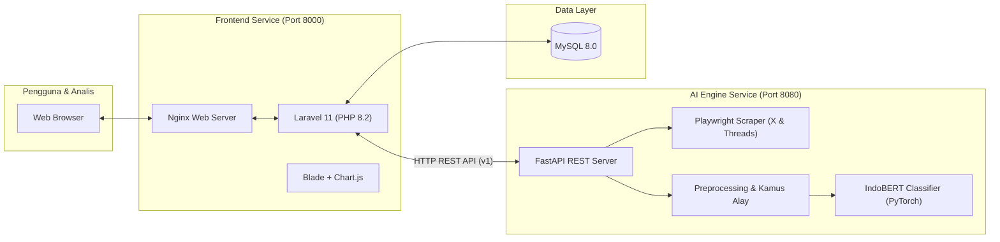

<div align="center">

# 🛡️ HateSense ID Lab
### Sistem Analisis & Deteksi Ujaran Kebencian Bahasa Indonesia Berbasis IndoBERT Hierarki

[](https://www.python.org/)
[](https://fastapi.tiangolo.com/)
[](https://pytorch.org/)
[](https://huggingface.co/indobenchmark/indobert-base-p1)
[](https://laravel.com/)
[](https://www.docker.com/)
[](https://www.mysql.com/)

<p align="center">
  <b>Platform terintegrasi untuk mendeteksi, mengkaji, dan memvisualisasikan ujaran kebencian secara multi-label dan hierarkis pada media sosial (X / Twitter & Threads) menggunakan deep learning Transformer (IndoBERT).</b>
</p>

[Fitur Utama](#-fitur-utama) •
[Taksonomi Model](#-taksonomi-klasifikasi-hierarki) •
[Arsitektur Sistem](#-arsitektur-sistem--alur-kerja) •
[Panduan Instalasi](#-panduan-instalasi--menjalankan) •
[Akun Pengujian](#-akun-pengguna-default-demo) •
[Dokumentasi API](#-dokumentasi-rest-api)

---
</div>

## 📌 Ringkasan Proyek

**HateSense ID Lab** dikembangkan sebagai bagian dari tugas akhir (Skripsi) untuk menjawab tantangan maraknya konten bermuatan kebencian di media sosial berbahasa Indonesia. Berbeda dengan pendekatan klasifikasi biner sederhana, sistem ini menggunakan **Hierarchical Multi-Task Learning (HMTL)** yang tidak hanya mendeteksi apakah suatu kalimat mengandung ujaran kebencian, tetapi juga memetakan sub-tipe atau kategori spesifik dari ujaran kebencian tersebut.

Sistem dirancang *end-to-end* yang menggabungkan:
1. **Engine AI (FastAPI & PyTorch)**: Melakukan pembersihan data, normalisasi slang/bahasa alay, inferensi model IndoBERT, serta scraper live headless browser.
2. **Web Dashboard (Laravel 11 & Blade)**: Antarmuka intuitif untuk analis sentimen, visualisasi statistik, manajemen dataset, dan kontrol akses berbasis peran (RBAC).
3. **Containerized Deployment (Docker & Compose)**: Lingkungan mandiri yang siap dijalankan dalam sekali klik tanpa perlu menginstall dependensi rumit secara manual.

---

## 🏷️ Taksonomi Klasifikasi Hierarki

Model dilatih menggunakan arsitektur fine-tuning **IndoBERT Base (`indobenchmark/indobert-base-p1`)** dengan dua kepala klasifikasi (*Dual Classification Head*):

```
                        [ Input Teks Komentar / Tweet ]
                                      │
                         [ IndoBERT Base Encoder ]
                                      │
              ┌───────────────────────┴───────────────────────┐
              ▼                                               ▼
     [ LEVEL 1: Deteksi Dasar ]                    [ LEVEL 2: Sub-Kategori ]
     ├── non_hate_speech                           ├── tidak_relevan
     └── hate_speech                               ├── delegitimasi_institusi
                                                   ├── dehumanisasi
                                                   ├── ajakan_kekerasan
                                                   ├── hoaks_pemicu_kebencian
                                                   └── kutukan_agama_personal
```

### Evaluasi Kinerja Model (Test Set):
* **Level 1 Accuracy**: **93.02%** *(Weighted F1-Score: 92.72%)*
* **Mekanisme Gating Konsistensi**: Jika Level 1 memprediksi `non_hate_speech`, output Level 2 secara otomatis diarahkan ke `tidak_relevan` demi menjaga konsistensi logis antar tingkat hierarki.

---

## 🚀 Fitur Utama

- 🔍 **Uji Prediksi Teks Tunggal (*Single Prediction*)**
  - Menganalisis kalimat langsung secara real-time.
  - Menampilkan skor probabilitas/confidence score untuk Level 1 dan Level 2 lengkap dengan interpretasi visual.
- 📁 **Analisis Batch File CSV (*Bulk Analysis*)**
  - Mengunggah dataset berformat CSV untuk pemrosesan massal.
  - Status pemrosesan asinkron dengan progress bar interaktif.
- 🌐 **Scraper Media Sosial Otomatis (X/Twitter & Threads)**
  - Mengambil komentar atau postingan publik berdasarkan kata kunci (*keyword*) atau tautan profil/thread.
  - Ditenagai headless browser **Playwright Chromium** yang mampu melewati rendering JavaScript dinamis.
  - Fitur manajemen sesi autentikasi browser tersimpan (*persistent session profile*).
- 🧹 **Preprocessing Teks Khusus Bahasa Indonesia**
  - Pembersihan URL, mention (`@user`), hashtag, angka, dan emoji.
  - Normalisasi kata tidak baku (slang/bahasa gaul) menggunakan kamus korpus `kamusalay.csv`.
- 📊 **Dashboard Analitik & Visualisasi**
  - Grafik perbandingan ujaran kebencian vs non-kebencian (Donut & Bar Charts via Chart.js).
  - Distribusi sub-kategori kebencian yang paling dominan.
  - Riwayat analisis tersimpan rapi per sesi investigasi.
- 📑 **Ekspor Laporan**
  - Unduh hasil klasifikasi ke dalam format **CSV** dan **PDF** untuk kebutuhan pelaporan atau arsip penelitian.
- 🔐 **Manajemen Hak Akses Pengguna (RBAC)**
  - Menggunakan Spatie Permission untuk membedakan hak akses Admin, Analyst, dan Viewer.

---

## 🏗️ Arsitektur Sistem & Alur Kerja



---

## 🛠️ Teknologi yang Digunakan (Tech Stack)

| Komponen | Teknologi | Keterangan |
|---|---|---|
| **Deep Learning** | PyTorch 2.2+, Transformers | Fine-tuned `indobenchmark/indobert-base-p1` |
| **Backend API** | FastAPI, Uvicorn, Pydantic | Arsitektur RESTful cepat & async |
| **Scraping Engine** | Playwright (Python Headless Chromium) | Automasi browser untuk X & Threads |
| **Frontend Framework** | Laravel 11, PHP 8.2 | Arsitektur MVC & orkestrasi bisnis |
| **UI & Visualisasi** | Blade Template, Chart.js, Vanilla CSS | Antarmuka responsif & interaktif |
| **Database** | MySQL 8.0 | Penyimpanan relasional pengguna & analisis |
| **Otentikasi & RBAC** | Laravel Breeze + Spatie Permission | Multi-role user management |
| **Containerization** | Docker, Docker Compose | Orkestrasi container lintas platform |

---

## 📁 Struktur Direktori Repositori

```
hate-speech-detection/
├── backend/                        # Layanan Backend FastAPI & AI Engine
│   ├── app/                        # Routers, schemas, dan REST API endpoints
│   ├── saved_models/               # Bobot model PyTorch & konfigurasi
│   │   ├── best_model.pt           # File model IndoBERT (~499 MB, auto-download)
│   │   ├── label_mapping.json      # Mapping index label hierarki
│   │   ├── model_config.json       # Hyperparameter arsitektur model
│   │   └── reports/                # Laporan metrik evaluasi (F1, Accuracy, dsb.)
│   ├── src/                        # Logika inti: classifier, preprocessing, scraper
│   │   ├── classification/         # Model loader & inference predictor
│   │   ├── preprocessing/          # Text cleaner & kamus normalisasi alay
│   │   └── scraping/               # Scraper Playwright untuk X & Threads
│   ├── storage/                    # Sesi browser & export sementara
│   ├── main_api.py                 # Titik masuk utama FastAPI
│   └── requirements.txt            # Dependensi paket Python
│
├── frontend/                       # Web Dashboard Laravel 11
│   ├── app/                        # Controllers, Models, Middleware, Services
│   │   └── Services/               # FastAPIClient service connector
│   ├── database/                   # Migrasi database & Seeder akun demo
│   ├── resources/views/            # Template Blade UI (Dashboard, Auth, Analysis)
│   ├── routes/                     # Definisi rute web aplikasi
│   └── composer.json               # Dependensi paket PHP
│
├── docker/                         # Konfigurasi Dockerfile & Script Startup
│   ├── backend/                    # Dockerfile backend (Python + Playwright) & entrypoint.sh
│   ├── frontend/                   # Dockerfile frontend (PHP-FPM) & entrypoint.sh
│   └── nginx/                      # Konfigurasi web server Nginx
│
├── .env.example                    # Template variabel lingkungan
├── docker-compose.yml              # Konfigurasi orkestrasi Docker
├── docker-up.bat                   # Script cepat start container (Windows)
├── docker-down.bat                 # Script cepat stop container (Windows)
└── README.md                       # Dokumentasi utama proyek
```

---

## 💻 Panduan Instalasi & Menjalankan

### Cara 1: Menggunakan Docker Compose (Sangat Direkomendasikan ⭐)

Metode ini paling mudah dan tidak membutuhkan instalasi manual PHP, Python, atau MySQL di laptop Anda.

#### Prasyarat:
* Pastikan [Docker Desktop](https://www.docker.com/products/docker-desktop/) sudah terpasang dan dalam keadaan aktif.

#### Langkah Menjalankan:
1. **Clone repositori:**
   ```bash
   git clone https://github.com/cipalipampam/hate-speech-detection.git
   cd hate-speech-detection
   ```

2. **Jalankan Aplikasi:**
   * **Pengguna Windows:** Cukup klik dua kali file **`docker-up.bat`**, atau jalankan di terminal:
     ```cmd
     docker-up.bat
     ```
   * **Pengguna Linux / macOS / Terminal Umum:**
     ```bash
     cp .env.example .env
     docker compose up -d --build
     ```

3. **Auto-Download Model AI:**
   * Saat pertama kali dijalankan, sistem secara otomatis mengunduh bobot model `best_model.pt` (~499 MB) dari GitHub Releases langsung ke folder `backend/saved_models/`.
   * Anda dapat memantau proses download di log backend:
     ```bash
     docker compose logs -f backend
     ```

4. **Akses Aplikasi:**
   * **Frontend Dashboard** : [http://localhost:8000](http://localhost:8000)
   * **FastAPI Docs (Swagger)** : [http://localhost:8080/docs](http://localhost:8080/docs)

5. **Menghentikan Aplikasi:**
   * Klik dua kali file **`docker-down.bat`** atau ketik `docker compose down`.

---

### Cara 2: Menjalankan Manual / Lokal (Tanpa Docker)

<details>
<summary><b>Klik untuk melihat panduan instalasi lokal manual</b></summary>

#### 1. Setup Backend (FastAPI):
```bash
cd backend
python -m venv venv

# Aktivasi venv:
# Windows:
.\venv\Scripts\activate
# Linux/macOS:
source venv/bin/activate

pip install --upgrade pip
pip install -r requirements.txt
playwright install chromium

# Jalankan server FastAPI:
uvicorn main_api:app --reload --host 0.0.0.0 --port 8080
```
*(Pastikan file `backend/saved_models/best_model.pt` sudah diletakkan di foldernya).*

#### 2. Setup Frontend (Laravel):
```bash
cd ../frontend
composer install
cp .env.example .env
php artisan key:generate

# Sesuaikan konfigurasi database MySQL di file .env
php artisan migrate --seed

# Jalankan server Laravel:
php artisan serve --port=8000
```
</details>

---

## 🔑 Akun Pengguna Default (Demo)

Setelah database dimigrasi dan di-seed, akun bawaan berikut siap digunakan untuk pengujian:

| Peran (*Role*) | Email | Password | Hak Akses Utama |
|---|---|---|---|
| **Administrator** | `admin@hatespeech.test` | `password` | Akses penuh: manajemen pengguna, konfigurasi sesi, seluruh fitur analisis |
| **Analyst** | `analyst@hatespeech.test` | `password` | Pengujian prediksi tunggal, upload CSV, scraping media sosial, ekspor laporan |
| **Viewer** | `viewer@hatespeech.test` | `password` | Hanya melihat visualisasi ringkasan dashboard & mengunduh laporan |

---

## 📡 Dokumentasi REST API

Backend FastAPI menyediakan dokumentasi interaktif berbasis OpenAPI:
* **Swagger UI** : `http://localhost:8080/docs`
* **ReDoc** : `http://localhost:8080/redoc`

### Ringkasan Endpoint Utama:
| Method | Endpoint | Fungsi |
|---|---|---|
| `GET` | `/health` | Healthcheck status server backend |
| `GET` | `/api/v1/classify/info` | Status model IndoBERT aktif & perangkat komputasi (CPU/CUDA) |
| `POST` | `/api/v1/classify/single` | Prediksi klasifikasi hierarki untuk 1 kalimat teks |
| `POST` | `/api/v1/classify/batch` | Prediksi klasifikasi hierarki untuk array/daftar teks |
| `POST` | `/api/v1/preprocess/clean` | Pembersihan teks & normalisasi slang tanpa klasifikasi |
| `POST` | `/api/v1/scrape/x` | Menjalankan scraping postingan/komentar X (Twitter) |
| `POST` | `/api/v1/scrape/threads` | Menjalankan scraping thread/komentar Threads |
| `POST` | `/api/v1/pipeline/run` | Menjalankan pipeline lengkap (Scraping $\rightarrow$ Preprocessing $\rightarrow$ Klasifikasi) |

---

## 👥 Penulis & Informasi Skripsi

Proyek ini disusun dan dikembangkan sebagai karya penelitian tugas akhir (Skripsi):

* **Peneliti / Pengembang**: Firman Agung Alamsyah
* **Judul Penelitian**: *Rancang Bangun Model IndoBERT Untuk Deteksi Ujaran Kebencian Studi Kasus Diskursus RKUHAP Di Media Sosial X dan Threads*
* **Institusi**: Politeknik Negeri Jember / Teknologi Informasi / Teknik Informatika

---

## 📄 Lisensi & Hak Cipta

Proyek ini dilisensikan di bawah [MIT License](LICENSE). Bebas digunakan dan dikembangkan untuk keperluan akademik dan penelitian dengan tetap mencantumkan atribusi penulis.
