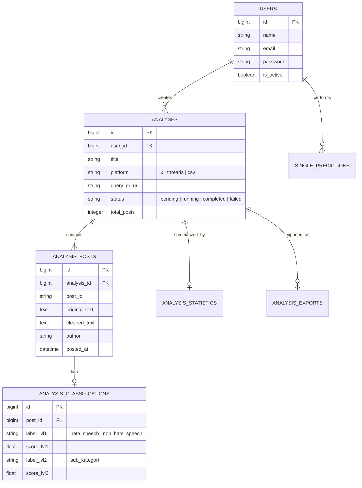

<div align="center">

# 💻 HateSense ID Lab — Frontend Web Dashboard
### Modern Web Interface, Data Visualization, & Business Orchestration Layer

[](https://www.php.net/)
[](https://laravel.com/)
[](https://spatie.be/docs/laravel-permission)
[](https://www.chartjs.org/)
[](https://getbootstrap.com/)
[](https://www.mysql.com/)

<p align="center">
  Aplikasi web monolitik modern berbasis <b>Laravel 11</b> yang menyediakan antarmuka pengguna interaktif, visualisasi grafik data sentimen, manajemen pengguna multi-peran (RBAC), serta orkestrasi bisnis yang terhubung ke <b>FastAPI Backend</b>.
</p>

---
</div>

## 📑 Daftar Isi
1. [Arsitektur & Pola Desain (Service Layer)](#-arsitektur--pola-desain-service-layer)
2. [Peta Struktur Direktori](#-peta-struktur-direktori)
3. [Fitur-Fitur Utama Web Dashboard](#-fitur-fitur-utama-web-dashboard)
4. [Struktur Database & Relasi Model](#-struktur-database--relasi-model)
5. [Manajemen Hak Akses Pengguna (RBAC)](#-manajemen-hak-akses-pengguna-rbac)
6. [Integrasi dengan Backend FastAPI](#-integrasi-dengan-backend-fastapi)
7. [Panduan Instalasi & Menjalankan](#-panduan-instalasi--menjalankan)
8. [Panduan Pemeliharaan & Troubleshooting (Maintenance Guide)](#-panduan-pemeliharaan--troubleshooting-maintenance-guide)

---

## 🏛️ Arsitektur & Pola Desain (Service Layer)

Frontend dirancang dengan pola **MVC (Model-View-Controller) + Service Layer Pattern** untuk memisahkan logika HTTP dengan logika bisnis:

```
[ HTTP Request ] ──> [ Controller ] ──> [ Service Layer ] ──> [ FastAPI Backend ]
                             │                  │                       │
                             ▼                  ▼                       ▼
                     [ Blade View / JSON ]  [ Eloquent ORM ]     [ IndoBERT Model ]
```

* **Controller**: Bertanggung jawab menerima request pengguna, validasi form, dan mengembalikan tampilan (*Blade View*) atau respon JSON.
* **Service Layer (`app/Services/`)**: Pusat logika bisnis (komunikasi API eksternal, pemrosesan file CSV impor, kalkulasi metrik analitik). Menjaga Controller tetap bersih (*skinny controllers*).
* **Eloquent Models (`app/Models/`)**: Manajemen persistensi data MySQL dengan relasi yang terstruktur.

---

## 📂 Peta Struktur Direktori

```
frontend/
├── app/
│   ├── Http/
│   │   ├── Controllers/
│   │   │   ├── Admin/
│   │   │   │   └── UserController.php         # Manajemen akun pengguna & role
│   │   │   ├── Auth/                          # Login, Register, Password Reset
│   │   │   ├── AnalysisController.php         # Buat, pantau, dan lihat sesi analisis
│   │   │   ├── DashboardController.php        # Halaman utama ringkasan statistik
│   │   │   ├── PredictController.php          # Halaman uji prediksi teks tunggal
│   │   │   ├── ProfileController.php          # Edit profil akun & ganti password
│   │   │   └── ScraperMonitorController.php   # Pemantau status antrean scraper
│   │   └── Middleware/                        # Autentikasi & pengecekan role Spatie
│   │
│   ├── Models/                                # Model Eloquent Database
│   │   ├── Analysis.php                       # Header sesi analisis (sumber, status)
│   │   ├── AnalysisClassification.php         # Hasil prediksi IndoBERT per komentar
│   │   ├── AnalysisExport.php                 # Riwayat file unduhan CSV/PDF
│   │   ├── AnalysisPost.php                   # Data mentah postingan media sosial
│   │   ├── AnalysisStatistic.php              # Agregasi metrik per sesi analisis
│   │   ├── SinglePrediction.php               # Log riwayat uji teks tunggal
│   │   └── User.php                           # Model pengguna terintegrasi Spatie
│   │
│   └── Services/                              # Core Service Layer
│       ├── AnalysisImportService.php          # Parsing file CSV massal
│       ├── AnalysisService.php                # Orkestrator alur analisis
│       ├── DashboardMetricsService.php        # Agregasi data visualisasi grafik
│       ├── FastAPIClientService.php           # HTTP Client penghubung ke FastAPI
│       ├── SinglePredictService.php           # Logika inferensi teks tunggal
│       └── UserManagementService.php          # Manajemen user dan hak akses
│
├── database/
│   ├── migrations/                            # Skema DDL tabel database
│   └── seeders/                               # Data awal akun demo & role
│       ├── DatabaseSeeder.php                 # Master seeder
│       ├── DemoAnalysisSeeder.php             # Sampel data analisis untuk presentasi
│       └── RoleAndPermissionSeeder.php        # Setup role Admin, Analyst, Viewer
│
├── resources/
│   ├── css/                                   # Kustomisasi stylesheet CSS
│   ├── js/                                    # Script interaktif (Chart.js & AJAX)
│   └── views/                                 # Template antarmuka Blade
│       ├── admin/                             # Tampilan kelola pengguna
│       ├── analysis/                          # Form input, polling status, & hasil
│       ├── auth/                              # Halaman login & register
│       ├── dashboard/                         # Dashboard analitik utama
│       ├── layouts/                           # Master layout, sidebar, & navbar
│       └── predict/                           # Interface uji coba teks tunggal
│
├── routes/
│   ├── auth.php                               # Rute autentikasi
│   ├── console.php                            # Artisan commands
│   └── web.php                                # Seluruh rute aplikasi web
│
├── composer.json                              # Dependensi paket PHP
└── package.json                               # Dependensi aset frontend (NPM)
```

---

## 🚀 Fitur-Fitur Utama Web Dashboard

### 1. Dashboard Eksekutif & Visualisasi
* **Kartu Ringkasan**: Total komentar dianalisis, rasio hate speech, distribusi platform (X vs Threads), dan sesi aktif.
* **Grafik Interaktif (Chart.js)**:
  - *Donut Chart*: Persentase ujaran kebencian vs non-kebencian.
  - *Bar Chart*: Distribusi 6 sub-kategori kebencian (delegitimasi institusi, dehumanisasi, ajakan kekerasan, dll.).
  - *Trend Timeline*: Fluktuasi kemunculan ujaran kebencian berdasarkan tanggal.

### 2. Uji Prediksi Teks Tunggal (*Single Prediction*)
* Input satu kalimat komentar langsung dari browser.
* Respon cepat via AJAX dengan tampilan badge label, skor probabilitas Level 1 (0–100%), dan rincian sub-kategori Level 2.

### 3. Manajemen Sesi Analisis (*Analysis Management*)
* **Input Fleksibel**:
  - **Live Scraper**: Masukkan URL postingan atau kata kunci (X/Twitter & Threads).
  - **File CSV**: Unggah dataset komentar dari file Excel/CSV lokal.
* **Halaman Progress Bar Real-Time**: Polling otomatis status scraping dan inferensi tanpa perlu me-refresh halaman browser.
* **Tabel Hasil Detail**: Menampilkan teks asli, teks hasil normalisasi, label prediksi, dan fitur pencarian/filter tabel.

### 4. Ekspor Laporan
* Unduh laporan lengkap hasil analisis dalam format **CSV** dan dokumen cetak **PDF**.

---

## 🗄️ Struktur Database & Relasi Model



---

## 🔐 Manajemen Hak Akses Pengguna (RBAC)

Sistem menggunakan paket **Spatie Laravel Permission** dengan 3 tingkatan peran:

| Role | Hak Akses (*Permissions*) | Keterangan |
|---|---|---|
| **Admin** | `manage-users`, `manage-auth-sessions`, `run-analysis`, `test-single-prediction`, `view-dashboard`, `export-reports` | Administrator sistem: akses penuh ke semua modul termasuk kelola akun pengguna. |
| **Analyst** | `manage-auth-sessions`, `run-analysis`, `test-single-prediction`, `view-dashboard`, `export-reports` | Peneliti/Analis data: dapat melakukan scraping, mengunggah CSV, dan ekspor laporan. |
| **Viewer** | `view-dashboard`, `export-reports` | Pengguna umum/Penguji: hanya dapat melihat data statistik dan mengunduh laporan. |

---

## 🔌 Integrasi dengan Backend FastAPI

Komunikasi antara Laravel dan FastAPI dikelola sepenuhnya oleh **`app/Services/FastAPIClientService.php`**:

* **Base URL Konfigurasi**:
  - Di Docker: `http://backend:8080` (DNS internal jaringan Docker).
  - Di Lokal/Host: `http://127.0.0.1:8080`.
* **Ketahanan Jaringan (*Resilience & Error Handling*)**:
  - Konfigurasi batas waktu request (*timeout*) yang fleksibel (hingga 120 detik untuk scraping).
  - Penanganan otomatis ketika FastAPI sedang dalam proses memuat model (`HTTP 503 Service Unavailable`), sehingga antarmuka menampilkan pesan tunggu yang ramah ke pengguna.

---

## 💻 Panduan Instalasi & Menjalankan

### Menggunakan Docker Compose (Direkomendasikan)
Frontend otomatis dibangun sebagai container PHP-FPM dan disajikan oleh web server Nginx pada port **8000**:
```bash
docker compose up -d --build frontend nginx
```

### Menjalankan Manual / Lokal
1. Pastikan terpasang **PHP >= 8.2** dan **Composer**.
2. Masuk ke folder frontend dan pasang dependensi:
   ```bash
   cd frontend
   composer install
   ```
3. Salin file environment dan generate encryption key:
   ```bash
   cp .env.example .env
   php artisan key:generate
   ```
4. Sesuaikan konfigurasi database di `.env`:
   ```ini
   DB_CONNECTION=mysql
   DB_HOST=127.0.0.1
   DB_PORT=3306
   DB_DATABASE=hatespeech_db
   DB_USERNAME=root
   DB_PASSWORD=rootsecret

   FASTAPI_BASE_URL=http://127.0.0.1:8080
   ```
5. Jalankan migrasi dan seeder akun demo:
   ```bash
   php artisan migrate --seed
   ```
6. Jalankan server lokal:
   ```bash
   php artisan serve --port=8000
   ```
   Akses di browser: `http://localhost:8000`.

---

## 🔧 Panduan Pemeliharaan & Troubleshooting (Maintenance Guide)

### 1. Error Koneksi ke Backend: `cURL error 7: Failed to connect to backend:8080`
* **Penyebab**: Container backend belum selesai menyala atau server Uvicorn belum siap.
* **Solusi**:
  1. Periksa log backend: `docker compose logs -f backend`.
  2. Pastikan file `backend/saved_models/best_model.pt` sudah selesai diunduh.

### 2. Role atau Permission Baru Tidak Terdeteksi
Spatie menyimpan permission di dalam cache memori Laravel:
```bash
# Reset cache permission:
php artisan permission:cache-reset
php artisan optimize:clear
```

### 3. Mengatur Ulang Database & Mengisi Ulang Data Demo
Jika Anda ingin mereset seluruh database dan mengembalikan akun demo default:
```bash
# Lewat container Docker:
docker compose exec frontend php artisan migrate:fresh --seed

# Lewat lokal:
php artisan migrate:fresh --seed
```

### 4. Menambah Kolom Baru pada Laporan Ekspor
Buka file controller atau service terkait di `app/Services/AnalysisService.php` pada fungsi `exportToCsv()`:
- Tambahkan header kolom pada array `$headers`.
- Petakan field model Eloquent ke dalam baris penulisan CSV.
